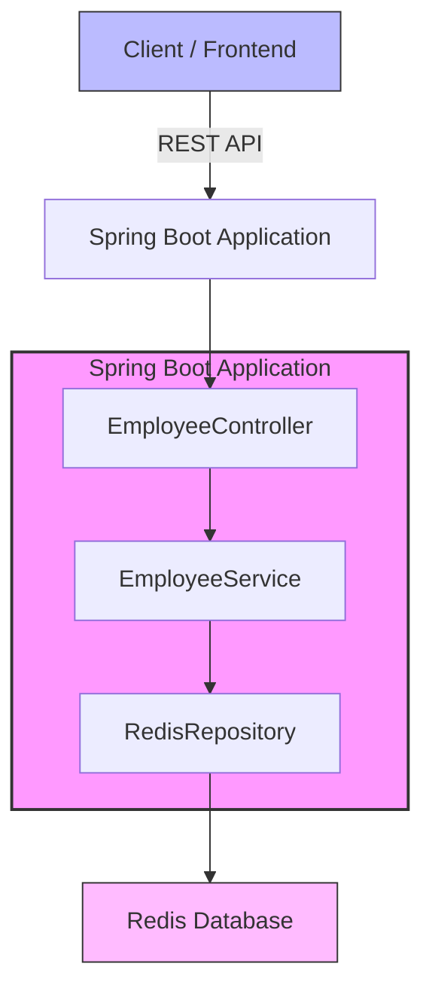
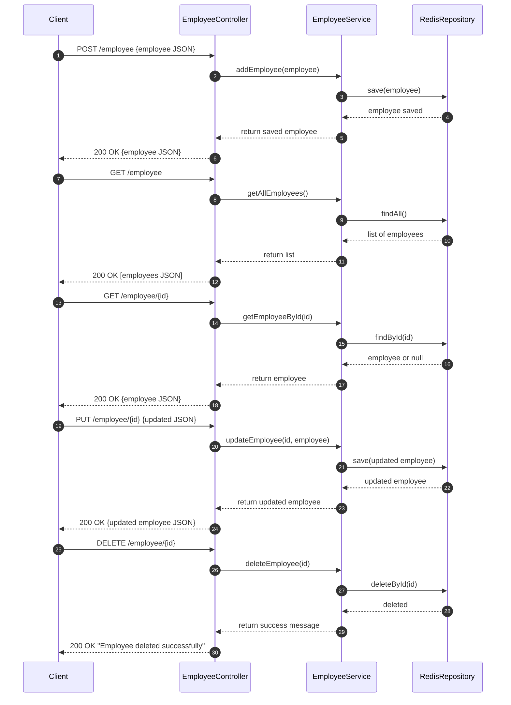

# 📌 spring-boot-redis-db-integration-service

## 🚀 Overview

Spring Boot application for **Employee Management** using **Redis as the database**.

* This service manages all employee data in **Redis**.
* The following **CRUD endpoints** are available:

    1. Add Employee
    2. Get All Employees
    3. Get Employee by ID
    4. Update Employee
    5. Delete Employee

---

## ✅ Tech Stack

* **Java 21**
* **Spring Boot 3.x**
* **Spring Data Redis**
* **Lombok**
* **Redis Server**
* **Gradle build system**
* **Plugins for code quality, formatting, and reporting**:

    * **PMD**: Static code analysis for best practices and code style
    * **Jacoco**: Code coverage analysis
    * **JUnit 5**: Unit and integration testing
    * **Spotless**: Automatic code formatting and style enforcement using Google Java Format

---

## ⚙️ Setup & Run

### 1. Install Redis on Windows

1. Download Redis for Windows from:
   **[Redis Windows Download (Microsoft Archive)](https://github.com/microsoftarchive/redis/releases/tag/win-3.2.100)**

2. Extract or install Redis to a folder, for example:

   ```
   C:\Program Files\Redis
   ```

3. Add Redis folder path to **System Environment Variables**:

   ```
   C:\Program Files\Redis
   ```

---

### 2. Start Redis Server

1. Open **Command Prompt as Administrator**.
2. Navigate to the Redis directory:

   ```bash
   cd "C:\Program Files\Redis"
   ```
3. Start the Redis server:

   ```bash
   redis-server.exe redis.windows.conf
   ```

   ✅ You should see `Ready to accept connections`.

---

### 3. Test Redis Connection

Run:

```bash
redis-cli
```

Then type:

```bash
ping
```

Expected response:

```
PONG
```

---

### 4. Clone the Project

```bash
git clone https://github.com/your-repo/spring-boot-employee-redis-service.git
cd spring-boot-employee-redis-service
```

---

### 5. Build and Run the Application

```bash
./gradlew clean build
./gradlew bootRun
```

The service will start at:
**`http://localhost:8080/api/v1/employee-mgmt-service`**

---

## 🧰 Gradle Plugins Overview

This project uses several **Gradle plugins** to ensure code quality, formatting, testing, and maintainability:

### 1. **Java Plugin**

* Compiles Java source code.
* Configures the project to use **Java 21** toolchain.

### 2. **Spring Boot Plugin**

* Allows running Spring Boot applications via Gradle.
* Provides tasks such as `bootRun` and `bootJar`.

### 3. **Dependency Management Plugin**

* Manages versions for Spring Boot dependencies.

### 4. **PMD Plugin**

* Static code analyzer to detect potential bugs, bad practices, and code style violations.
* Configured reports:

    * **HTML report:** `build/reports/pmd/pmd.html`
    * **XML report:** `build/reports/pmd/pmd.xml`
* Uses rulesets like `bestpractices.xml` and `codestyle.xml`.
* Only analyzes `src/main/java` to avoid Java 21 compatibility issues with test classes.

### 5. **Jacoco Plugin**

* Provides **code coverage analysis** for tests.
* Generates:

    * **HTML report:** `build/reports/jacoco/html/index.html`
    * **XML report:** `build/reports/jacoco/jacoco.xml`
* Configured to exclude:

    * Main Spring Boot class
    * Constants
    * Utility classes
* Minimum coverage set to **70%**.

### 6. **JUnit 5 Integration**

* Configured in Gradle test task.
* Test reports generated:

    * **HTML:** `build/reports/tests/test/index.html`
    * **XML:** `build/reports/tests/test/xml/`
* Console logging shows **passed/failed/skipped tests** with full stack traces.

### 7. **Spotless Plugin**

* Ensures **automatic code formatting** and style enforcement.
* Uses **Google Java Format** for all Java source files.
* Features:

    * Removes trailing whitespace
    * Ensures files end with a newline
    * Applies consistent formatting across the project
* Commands:

    * **Check formatting:**
      ```bash
      ./gradlew spotlessCheck
      ```
    * **Apply formatting:**
      ```bash
      ./gradlew spotlessApply
      ```
* Configured to target all Java files under `src/**/*.java`.

---

## 🏗 Architecture Overview



---

## 🔄 Sequence Diagram



---

## 📌 API Details

### **Base URL**

```
http://localhost:8080/api/v1/employee-mgmt-service
```

---

### ✅ 1. Add Employee

* **URL:** `/employee`
* **Method:** `POST`
* **Request:**

```json
{
  "id": "101",
  "name": "Siddhant",
  "department": "Engineering",
  "salary": 100000
}
```

* **Response:**

```json
{
  "id": "101",
  "name": "Siddhant",
  "department": "Engineering",
  "salary": 100000.0
}
```

---

### ✅ 2. Get All Employees

* **URL:** `/employee`
* **Method:** `GET`
* **Response:**

```json
[
  {
    "id": "101",
    "name": "Siddhant",
    "department": "Engineering",
    "salary": 100000.0
  }
]
```

---

### ✅ 3. Get Employee by ID

* **URL:** `/employee/{id}`
* **Method:** `GET`
* **Response:**

```json
{
  "id": "101",
  "name": "Siddhant",
  "department": "Engineering",
  "salary": 100000.0
}
```

---

### ✅ 4. Update Employee

* **URL:** `/employee/{id}`
* **Method:** `PUT`
* **Request:**

```json
{
  "name": "Siddhant Patni",
  "department": "Technology",
  "salary": 120000
}
```

* **Response:**

```json
{
  "id": "101",
  "name": "Siddhant Patni",
  "department": "Technology",
  "salary": 120000.0
}
```

---

### ✅ 5. Delete Employee

* **URL:** `/employee/{id}`
* **Method:** `DELETE`
* **Response:**

```
Employee deleted successfully
```

---

## ✅ Data Store

* **Redis Key:** `Employee`
* **Serialization:** `Serializable` via `@RedisHash("Employee")`

---

### 🔗 Future Enhancements:

* Implement **Pagination & Sorting**
* Add **Spring Security** for Authentication
* Integrate with **Kafka for Event Streaming**
* Integrate **Checkstyle** for additional code style enforcement
* Generate **CI/CD reports** using Gradle tasks

---